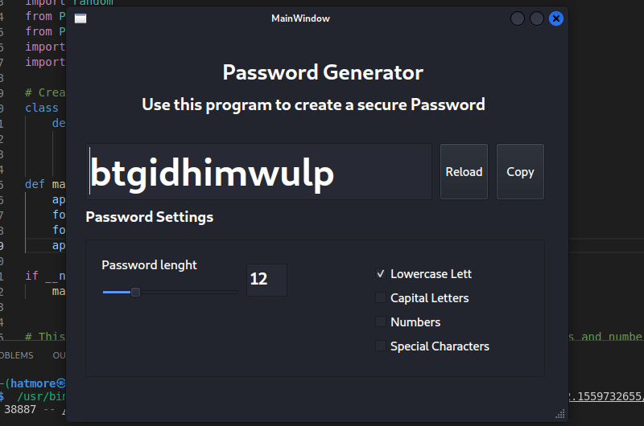

# Password Generator App

The Password Generator App is a simple yet powerful tool designed to create secure and customizable passwords. Developed with Python and PyQt5, this application provides users with the flexibility to generate passwords of varying lengths and with different character combinations, including lowercase letters, uppercase letters, numbers, and special characters.

## Features

- Generate passwords with varying lengths and character combinations.
- Choose from lowercase letters, uppercase letters, numbers, and special characters.
- Real-time password regeneration.
- Copy passwords directly to the clipboard for easy use.
- Intuitive graphical user interface (GUI) built using PyQt5.

## Screenshots


*Fig. 1: The Password Generator App's user-friendly interface.*

## How It Works

1. Launch the Password Generator App.
2. Adjust the password length using the slider.
3. Choose the character combinations you want in your password by selecting the checkboxes for lowercase letters, uppercase letters, numbers, and special characters.
4. Click the "Reload" button to generate a new password based on your preferences.
5. The generated password will be displayed in the text field.
6. Click the "Copy" button to copy the generated password to the clipboard for easy use.

## Getting Started

To run the Password Generator App:

1. Make sure you have Python installed on your system.
2. Install the necessary dependencies using the following command:
   ```bash
   pip install PyQt5 pyperclip
   ```
3. Download the "passgenerator" folder and its contents to your local machine.
4. Open a terminal and navigate to the "passgenerator" directory.
5. Run the `passwordGenerator.py` script using the following command:
   ```bash
   python passwordGenerator.py
   ```

## Contact

For any questions or feedback, feel free to get in touch:

Name: Morteza Hatami
Email: m.hatami@live.com
